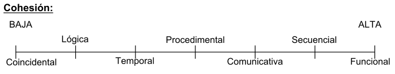
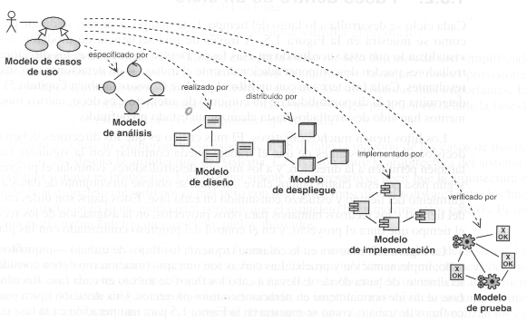

**************************************************
Resumen final de Diseño de sistemas de información
**************************************************

Unidad 1: Fundamentos del Diseño
================================

El **diseño de sistemas** es la actividad de aplicar métodos, técnicas y herramientas, con el objeto de definir un proceso, dispositivo o sistema con el suficiente nivel de detalle como para permitir su realización física. El diseño es un proceso que termina en una definición rigurosa. A mayor definición se deja menos riesgo de equivocación al programador. Es el proceso de planificar, reemplazar o complementar un sistema organizacional existente.

Diagrama del desarrollo
------------------------

Los requisitos del sistema establecidos mediante los modelos de información, funcional y de comportamiento alimentan el paso del Diseño

   Figura 1: Diagrama del desarrollo

El plan de prueba se desarrolla desde el análisis. El diseño es el primer paso en la fase de desarrollo de cualquier producto o sistema de ingeniería. Podría definirse como el proceso de aplicar distintas técnicas, métodos y herramientas con el objetivo de **definir** un dispositivo, proceso o sistema, con el suficiente nivel de detalle para permitir su realización física (codificación).

El objetivo del diseñador es producir un modelo o representación de una entidad que se va a construir más adelante, combina la intuición y los criterios en base a la experiencia y un conjunto de heurísticas y/o principios que guían la forma en que se desarrolla el modelo.

El diseño constituye la base para la construcción y el mantenimiento del software.

Niveles de diseño desde el punto de vista técnico
--------------------------------------------------

**Diseño arquitectónico:** define la relación entre los elementos estructurales principales del software, los patrones de diseño que se pueden utilizar para lograr los requisitos que se han definido para el sistema, y las restricciones que afectan a la manera en que se pueden aplicar los patrones de diseño arquitectónico.

**Diseño procedimental:** transforma los elementos estructurales en una descripción procedimental del software.

**Diseño de datos:** transforma el modelo del dominio de información que se crea durante el análisis en las estructuras de datos que se necesitarán para implementar el software. Es posible que parte del diseño de datos tenga lugar junto con el diseño de la arquitectura del software.

**Diseño de interfaz:** establece la disposición y los mecanismos para la interacción hombre - máquina. Una interfaz implica un flujo de información y un tipo específico de comportamiento. Por lo tanto, los diagramas de flujo de datos y de control proporcionan la información necesaria para el diseño de la interfaz.

**Niveles de diseño desde el punto de vista de gestión**

**Diseño preliminar:** se centra en la transformación de los requisitos en los datos y la arquitectura del software.

**Diseño detallado:** se acerca más a la implementación. Se ocupa del refinamiento de la representación arquitectónica que lleva a una estructura de datos detallada y las representaciones algorítmicas del software.

**El proceso de diseño**

El diseño de software es un proceso iterativo a través del cual se traducen los requisitos en una representación del software. A lo largo del proceso de diseño, se evalúa la calidad del diseño con una serie de revisiones técnicas formales. Hay dos características que sirven de directrices para la evaluación de un buen diseño:

1.	El diseño debe ser una guía que puedan leer y entender los que construyan el código y los que prueban y mantienen el software.

2.	El diseño debería proporcionar una completa idea de lo que es el software, enfocando los dominios de datos, funcional y de comportamiento desde la perspectiva de la implementación.

Princicios del diseño: el diseño de software es tanto un proceso como un modelo. El proceso de diseño es una secuencia de pasos que hacen posible que el diseñador describa todos los aspectos del software que se va a construir. Es sólo un recetario.

*	El proceso de diseño no deberá utilizarse: un buen diseñador deberá tener en cuenta enfoques alternativos, juzgando todos los que se basan en los requisitos del problema, los recursos disponibles para realizar el trabajo y los conceptos del diseño.
*	El diseño deberá poderse rastrear hasta el modelo de análisis: es necesario tener un medio de rastrear cómo se han satisfecho los requisitos por el modelo de diseño.
*	El diseño no deberá inventar nada que ya esté inventado: el tiempo de diseño se deberá invertir en la representación verdadera de ideas nuevas y en la integración de esos patrones ya existentes.
*	El diseño deberá minimizar la distancia intelectual entre el software y el problema: la estructura del diseño del software (siempre que sea posible) imita la estructura del dominio del problema.
*	El diseño deberá presentar uniformidad e integración: un diseño es uniforme si parece que fue una persona la que lo desarrolló por completo. Se integra si se tiene cuidado a la hora de definir interfaces entre los componentes del diseño.
*	El diseño deberá estructurarse para admitir cambios.
*	El diseño deberá estructurarse para degradarse poco a poco: debe diseñarse para adaptarse a circunstancias inusuales, y si debe terminar de funcionar, que lo haga de forma suave.
*	El diseño no es escribir código y escribir código no es diseñar: incluso cuando se crean diseños procedimentales para componentes de programas, el nivel de abstracción del modelo de diseño es mayor que el código fuente.
*	El diseño deberá evaluarse en función de la calidad mientras se va creando, no después de terminarlo.
*	El diseño deberá revisarse para minimizar los errores conceptuales (semánticos).

Fundamentos del diseño
-----------------------

Se ha establecido un conjunto de conceptos fundamentales para el diseño del software.

1.	**Abstracción:** es la visión del problema a diferentes niveles de detalles y desde diferentes perspectivas. Es una capacidad que debe tener el diseñador. Puede ser de datos (determinada colección de datos que describen un objeto, *cheque nómina*), procedimental (determinada secuencia de instrucciones que tiene una función limitada y específica, *palabra pase en una puerta*) o de control (implica un mecanismo de control de programa, sin especificar los detalles internos, *semáforo de un S.O*).
2.	**Refinamiento:** significa plantear un problema a un nivel de abstracción alto e ir conociéndolo en más detalle en distintos niveles más bajos de abstracción. Este refinamiento de especificaciones termina cuando todas las instrucciones se expresan en términos de cualquier lenguaje de programación. El refinamiento se puede hacer sobre distintos aspectos, no sólo la programación.
3.	**Arquitectura:** la arquitectura determina la relación entre piezas de programa. Un objetivo del diseño del software es crear una versión arquitectónica de un sistema. Esta versión sirve como estructura desde la que se pueden llevar a cabo actividades de diseño más detalladas.
4.	**Jerarquía de control:** representa la organización (a menudo jerárquica) de componentes del programa (módulos). No representa aspectos procedimentales del software.

   Figura 2: Jerarquía de módulos

5.	**Modularidad:** es un atributo del software que lo hace manejable intelectualmente. El esfuerzo de desarrollo de un modulo individual disminiye conforme aumenta en número de módulos, sin embargo el esfuerzo asociado a las interfaces entre los módulos, va creciendo, esto nos lleva a una curva de esfuerzo total.

Hay un número M de módulos que resultaría en un costo de desarrollo mínimo, pero no tenemos la sofisticación necesaria para predecir M con seguirad.

   Figura 3: Costo mínimo

6.	**Estructuras de datos:** es una representación de la relación lógica entre los elementos individuales de datos.
7.	**Estructuras de control:**
8.	**Ocultación y encapsulamiento de la información:** el principio de ocultación de información sugiere que los módulos se caractericen por decisiones de diseño que hagan que cada uno se oculte de los demás. Con otras palabras, se deberían especificar y diseñar los módulos para que la información (procedimientos y datos) contenida dentro de ellos sea inaccesible a otros módulos que no la necesiten.

**Diseño Modular:** un diseño modular reduce la complejidad, facilita los cambios y hace más fácil la implementación al fomentar el desarrollo en paralelo de diferentes partes de un sistema.

**Independencia funcional:** es un atributo de los módulos que determina o describe hasta que punto el módulo cumple con una única función específica, y no necesita para eso de otros de módulos. Un módulo funcionalmente independiente es un módulo bien encapsulado.

El software con módulos independientes, es fácil de desarrollar porque su función puede ser partida y se simplifican las interfaces, son más fáciles de mantener, y se reduce la programación de errores y se fomenta la reutilización de los módulos. La independencia se mide usando dos criterios cualitativos: cohesión y acoplamiento.

**Cohesión:** es la fuerza con la que están unidas las sentencias de un módulo para cumplir la función. Es el grado en el cual los componentes de un módulo (las instrucciones individuales) son necesarios y suficientes para llevar a cabo una sola función bien definida. Cuando todas las sentencias son indispensables entonces la cohesión es alta.

**Acomplamiento:** es el grado de interdependencia que existe entre los módulos. La situación ideal sería que no haya interdependencia. El acomplamiento es el grado en el cual los módulos se relacionan entre sí. Mientras más fuerte sea el acomplamiento entre módulos en un sistema, más difícil es implantarlo y mantenerlo. A menor acoplamiento, mejor.

   Figura 4: Cohesión

   Figura 5: Acomplamiento

La calidad como objetivo
--------------------------

La importancia del diseño del software se puede decir con una sola palabra: calidad. El diseño es el lugar donde se fomenta la calidad en el desarrollo del software. El diseño nos proporciona representaciones del software en las que se puede valorar la calidad.

La calidad es un atributo del software que determina la concordancia con atributos de utilidad, mantenibilidad y portabilidad. Los factores que afectan a la calidad del software se pueden categorizar en dos grandes grupos: factores que se pueden medir directamente (defectos por punto de función) y factores que se pueden medir sólo indirectamente (facilidad de uso). En todos los casos debe aparecer la medición. Debemos comparar el software con un standard y llegar a una conclusión sobre la calidad.

Algunos factores son:

1.	Corrección: hasta dónde satisface un programa su especificación y logra los objetivos de la misión del cliente.
2.	Fiabilidad: hasta dónde se puede esperar que un programa lleve a cabo su función pretendida con la exactitud requerida.
3.	Eficiencia: hasta dónde el programa cumple su objetivo con la mejor utilización de los recursos.
4.	Integridad: hasta dónde se puede controlar el acceso al software o a los datos por personas no autorizadas.
5.	Facilidad de uso: el esfuerzo necesario para aprender, operar, preparar los datos de entrada e interpretar las salidas de un pograma.
6.	Facibilidad de mantenimiento: el esfuerzo necesario para localizar y arreglar un error en un programa.
7.	Flexibilidad: el esfuerzo necesario para modificar un programa.
8.	Facilidad de prueba: el esfuerzo necesario para probar un programa para asegurarse de que realizar su función pretendida.
9.	Portabilidad: el esfuerzo necesario para transferir el programa de un entorno de sistema hardware y/o software a otro.
10.	Reusabilidad: hasta dónde se puede volver a usar un programa (o partes de él) en otras aplicaciones.
11.	Interoperatividad: el esfuerzo necesario para acoplar un sistema con otro.

Unidad 2: Niveles de diseño
===========================

Niveles
--------

**Diseño de datos:** la actividad principal del diseño de datos es seleccionar representaciones lógicas de objetos de datos (estructuras de datos) identificadas durante la fase de definición y especificación de requisitos. La estructura de datos ha sido siempre una parte importante del diseño de software.

**Diseño arquitectónico:** el objetivo del diseño arquitectónico es desarrollar una estructura de programa modular y representar las relaciones de control entre los módulos. Además, el diseño arquitectónico combina la estructura del programa y las estructuras de datos, definiendo interfaces que permiten el flujo de datos a través del programa.

**Diseño procedimental:** el diseño procedimental se realiza después de los diseños de datos, arquitectónico y de interfaz. En un mundo ideal, la especificación procedimental necesaria para definir los detalles de los algoritmos se expresaría en un lenguaje natural. Debe especificar los detalles procedimentales sin abigüedades.

**Diseño de la interfaz con el usuario:** es la definición de interacción hombre - máquina. Estos mecanismos de interacción incluyen también a los dispositivos. La interfaz es la frontera entre el usuario y la aplicación del sistema (el punto donde la computadora y el individuo interactúan). Sus características influyen en la eficiencia del usuario, al igual que en la frecuencia de errores cuando se introducen datos o instrucciones.

Aspectos del diseño de interfaz
--------------------------------

**Aspectos humanos:** se analiza al ser humano como persona (independientemente de la aplicación).

1.	Percepción:

	*	Sentidos: el sentido que guía nuestro diseño es la vista.
	*	Capacidad cognitiva de la lectura: capacidad de adquirir conocimiento con la lecutra. Se debe aprovechar.
	*	Memoria: hay dos tipos de memoria, de corto plazo y de largo plazo. El usuario puede acordarse de los comandos.
	*	Mecanismos de deducción/inducción: es otra capacidad importante del usuario. Si hace una cosa siempre de la misma manera, es natural que lo intente hacer otra vez.

2.	Comportamiento:

	*	Personalidad: tiene que ver con cada persona.
	*	Experiencia: (novatos, intermedios, expertos).

**Aspectos técnicos:** nos preocupan:

1.	Dispositivos: se deben definir dispositivos de entrada (mouse, teclado, lectores, cámaras, pantallas sensibles al tacto) y de salida (impresora, pantalla).
2.	Diseño de entrada - salida: problema de aumentar la productividad del usuario. Implica el diseño de la entrada y salida de datos. Formularios.
3.	Niveles de ayuda: toda interfaz debe tener algún nivel de ayuda (sensible al contexto, en línea, teclas calientes).
4.	Retroalimentación: es la información que le damos al usuario constantemente sobre los resultados de lo que está haciendo. (Archivos log, barra de progreso, porcentajes, manejo de errores).
5.	Tipo de interfaz: existen varios tipos.

	*	De comandos: DOS es una interfaz de comandos. Requiere conocimiento del usuario.
	*	De menús: NORTON por ejemplo. El usuario elige entre las opciones en pantalla.
	*	De pregunta/respuesta: nos pregunta y le respondemos para que pueda hacer lo que queremos.
	*	De manejo directo: brinda la posibilidad de acceder a diferentes acciones combinando cosas de las otras interfaces. Tengo el control de todo (puedo abrir un menú, escribir, apretar un botón, etc).
	*	De ventanas: la idea es que pueda ver distintas cosas al mismo tiempo en varias ventanas.
	*	Entrada salida: formas (formulario / llenado de datos).

**Diseño de la entrada:** en el diseño de entradas los analistas de sistemas deciden qué datos ingresan al sistema, qué medios utilizar, la forma en que se deben disponer o codificar los datos, el diálogo que servirá de guía a los usuarios para dar entrada a los datos, validación necesaria de datos y transacciones para detectar errores y los métodos para llevar a cabo la validación de las entradas y los pasos a seguir cuando se presentan errores.

El diseño de la entrada también incluye la especificación de los medios por los que tanto los usuarios finales como los operadores darán instrucciones al sistema sobre las acciones que deben emprender.

**Diseño de la salida:** el término salida se refiere a los resultados e información generados por el sistema. Cuando diseñan la salida, los analistas deben determinar qué información presentar, decidir si la información será presentada en forma visual, verbal o impresa y seleccionar el medio de salida, disponer la presentación de la información en un formato aceptable y decidir cómo distribuir la salida entre los posibles destinatarios.

**Diseño de controles:** los diseñadores también deben anticipar los errores que se cometerán al ingresar los datos en el sistema o al solicitar la ejecución de ciertas funciones. Un buen diseño de un sistema de información ofrecerá los medios para detectar y manejar el error.

Los controles de entrada proporcionan medios para asegurar que sólo los usuarios autorizados tengan acceso al sistema, garantizar que las transacciones sean aceptables, validar los datos para comprobar su exactitud y determinar si se han omitido datos que son necesarios.

**Validación de la entrada:** el término general dado a los métodos cuya finalidad es detectar errores en la entrada es *validación de entradas*. Tres categorías principales de métodos tienen que ver con la verificación de la transacción, la verificación de los datos de la transacción y el cambio de estos últimos.

**Verificación de la transacción:** lo primero y lo más importante es identificar todas las transacciones que no son válidas. Las transacciones	pueden caer en esta categoría porque están incompletas, no autorizadas e incluso fuera de lugar.

**Validación de transacciones:** los pasos que el sistema sigue para asegurarse de que la transacción es aceptable reciben el nombre de validación de la transacción. Por ejemplo, no es aceptable tratar de añadir un artículo nuevo si existe ya uno con el mismo nombre y número de identificación. El analista también debe asegurar que los procesos de validación de transacciones detecten situaciones donde se envía una entrada aceptable por un usuario que no está autorizado para hacerlo.

**Verificación de los datos de la transacción:** los analistas deben asegurarse de especificar métodos para validar los datos cuando desarrollan los procedimientos de entrada. Existen cuatro métodos para validar los datos de entrada:

*	Pruebas de existencia: algunos de los campos de datos de las transacciones son diseñados para no dejarlos vacíos o en blanco. Las pruebas de existencia examinan los campos esenciales para determinar que estos contengan datos.
*	Pruebas de límites y rangos: las pruebas de límites sirven para validar la cantidad mínima o máxima aceptable para un dato. Las pruebas de rango validan tanto los valores mínimos como máximos.
*	Pruebas de combinación: validan el hecho de que varios datos tengan al mismo tiempo valores aceptables; en otras palabras, el valor de un campo determina si son correctos los valores de los demás datos.
*	Procesamiento duplicado: en áreas especificamente importantes, quizá sea necesario procesar los datos más de una vez, ya sea en un equipo diferente o en una forma distinta. Después de dicho procesamiento, los resultados se comparan para determinar su consistencia y exactitud.

Prototipos
----------

El prototipo no contiene todas las características o lleva a cabo la totalidad de las funciones necesarias del sistema final. Más bien incluye elementos suficientes para permitir a las personas utilizar el sistema propuesto para determinar qué les sirve e idenficar aquellas características que deben cambiarse o añadirse. Sirven para resolver problemas que no están claros. Los prototipos tiene dos características importantes: que implica la participación del usuario y la iteración (se debe evaluar y mejorar varias veces con la participación del usuario).

El proceso de desarrollo y empleo de un prototipo tiene cinco características:

1.	El prototipo es una aplicación que funciona.
2.	La finalidad del prototipo es probar varias suposiciones formuladas por analistas y usuarios con respecto a las características requeridas del sistema.
3.	Los prototipos se crean con rapidez.
4.	los prototipos evolucionan a través de un proceso iterativo.
5.	Los prototipos tiene un costo bajo de desarrollo.

El desarrollo de prototipos tiene dos usos principales.

Por un lado, es medio eficaz para aclarar los requerimientos de los usuarios. El desarrollo y uso de un prototipo puede ser un camino muy eficaz para identificar y aclarar los requerimientos que debe satisfacer una aplicación.

El segundo uso del prototipo de aplicación es verificar la factibilidad del diseño de un sistema. Crear un prototipo y evaluar el diseño por medio de su uso, mostrará la factibilidad del diseño o sugerirá la necesidad de encontrar otras opciones.

Cualquiera de las siguientes cinco condiciones sugieren la necesidad de utilizar un prototipo:

1.	No se conocen los requerimientos: la naturaleza de la aplicación es tal que existe poca información disponible con respecto a las características que debe tener el sistema para satisfacer los requerimientos de los usuarios.
2.	Los requerimientos necesitan evaluarse: se conocen los requerimientos aparentes de información, tanto de usuarios finales como de la organización, pero es necesario varificarlos y evaluarlos.
3.	Costos altos: la inversión de recursos finacieros y humanos así como el tiempo necesario para generar la aplicación es sustancial.
4.	Alto riesgo: la evaluación inexacta de los requerimientos del sistema o el desarrollo incorrecto de una aplicación ponen en peligro a la organización, a sus empleados y también a sus propios recursos.
5.	Nueva tecnología: muchas compañias no tienen experiencia en el uso de cierta tecnología ni tampoco las demás organizaciones con las que se comunican.

Es responsabilidad del usuario trabajar con el prototipo y evaluar sus características y operación. Los cambios al prototipo son planificados con los usuarios antes de llevarlos a cabo. Sin embargo, el analista es el responsable de realizar las modificaciones.

**Consejos en el diseño de la interfaz con el usuario**

a)	Interacción en general:
	
	1.	La interfaz debe ser consistente.
	2.	Proveer al usuario de retroalimentación significativa.
	3.	Verificar acciones destructivas.
	4.	Permitir al usuario volver atrás.
	5.	Reducir la cantidad necesaria de memoria del usuario necesaria para operar el sistema.
	6.	Buscar eficiencia en el diálogo, el movimiento y el accionar en general del usuario.
	7.	Perdonar errores.
	8.	Categorizar las actividades y respetar la geografía de la pantalla.
	9.	Proveer al usuario de ayuda, en lo posible sensible al contexto.
	10.	Utilizar verbos simples para describir las acciones que puede realizar el usuario.

b)	Visualización de información:
	
	1.	Mostrar solamente la información relevante.
	2.	No abrumar al usuario con detalles.
	3.	Utilizar etiquetas adecuadas y consistentes.
	4.	Mantener el contexto visual (que el usuario vea todo lo que se muestra).
	5.	Usar mayúsculas y minúsculas, agrupar y tabular la información.
	6.	Utilizar ventanas.
	7.	Utilizar representaciones analógicas (gráficos, mapas).
	8.	Mantener el esquema de la pantalla.

c)	Entrada de datos:
	
	1.	Minimizar la cantidad de acciones que debe hacer el usuario.
	2.	Mantener la consistencia entre lo que se ingresa y lo que se ve.
	3.	Permitir al usuario personalizar la entrada de datos.
	4.	Desactivar las órdenes que no están permitidas o están fuera del contexto.
	5.	Permitir que el usuario tenga el control del programa, en la medida de lo posible.
	6.	Asistir al usuario con ayudas en todo momento.
	7.	Eliminar datos innecesarios. Dos clases de datos: los que pueden ser deducidos o calculados.
	

Herramientas para modelar la interfaz con el usuario
----------------------------------------------------

**Árbol de navegación:** herramienta gráfica que modela las posibilidades de acción voluntaria que tiene el usuario. Es una herramienta interna para el desarrollo y para el usuario.

**Diagrama de transición de estados:** herramienta gráfica que modela el comportamiento del sistema dependiente del tiempo a través de los distintos estados que éste puede tomar.

**Diseño de pantallas:** herramienta gráfica que modela la forma de la pantalla.

Unidad 3: Diseño estructurado
=============================

   Figure 6: Diagrama de modelos

Modelos
-------

**Modelo de implementación:** describe las especificaciones técnicas para la construcción del sistema.

**Modelo del usuario:** contiene la visión, requerimientos y restricciones de los usuarios. Todo lo que pide el usuario que no esté en el modelo esencial, debe ir aquí.

De manera general, el modelo de implantación del usuario cubre los siguientes cuatro puntos:

1.	Distribución del modelo esencial entre personas y máquinas. Se determina la frontera de automatización. Basándose en interacciones entre el usuario, el analista y el equipo de implantación, se autorizará parte de las actividades del modelo esencial y otras se identificarán como actividades manuales.
2.	Detalles de la interacción hombre-máquina. Se determina la interfaz humana. Es la actividad que consume más tiempo e involucra la elección de los dispositivos de entrada y salida, el formato de todas las entradas y salidas, y la secuencia y los tiempos de entradas y salidas en un sismtea en línea. No se diseña, sólo se especifica.
3.	Actividades manuales que se podrían requerir. Se identifican las actividades de apoyo manual adicional necesarias para asegurar la integridad del sistema.
4.	Restricciones operativas que el usuario desea imponer al sistema, entre las que se cuentan volumen de datos, de tiempo de respuesta, restricciones ambientales, de seguridad y otras.
  
**Etapas del diseño:** la activdad de diseño involucra el desarrollo de una serie de modelos. Los modelos más importantes para el diseñador son el modelo de distribución y el modelo de programas.

**Modelo de distribución:** define quién(procesador) hace qué. Se determina qué procesos quedan dentro del sistema y cuáles fuera. Las tareas de procesador, no humanas. Este modelo se divide en el modelo de procesadores y el modelo de tareas.

	*	En el **modelo de procesadores** el diseñador trata de decidir cómo asignar procesos a los componentes apropiados de hardware y cómo deben comunicarse entre sí los procesadores. También se deben asignar almacenes de datos. Se deben tener en cuenta varios factores al hacer estas asignaciones, como costos, eficiencia, seguridad y confiabilidad.
	*	En el **modelo de tareas**, una vez que se han asignado procesos y almacenes a los procesadores, el diseñador debe, procesador por procesador, asignar procesos y almacenes a las tareas individuales de cada uno.

**Modelo de programas:** contiene el diseño arquitectónico, el de datos, el procedimental y el de interfaz. Aquí se define cómo va a ser el sistema. Las herramientas que se utilizan en este modelo son diagrama de flujo de datos (DFD), diagrama de entidad relación (DER), diccionario de datos (DD), diagrama de transacción de estados (DTE) y carta de estructura (CE).

Pasos del modelo de programas:

1.	Refinamiento del DFD: cada proceso del DFD se puede convertir en un módulo. Debo llegar a procesos (módulos) elementales.
2.	Determinación de tipos de flujos.
3.	Determinación de límite de flujos (necesario para el paso 4).
4.	Factorización para derivar la estructura. A cada tipo de flujo le queremos asignar un tipo de estructura.
5.	Refinamiento de la estructura aplicando heurísticas de diseño (acciones asumidas como válidas, pero demostradas).

**Factorización:** es el proceso por el cual se intenta colocar a los módulos que toman decisiones en los niveles superiores, y a los módulos que realizan operaciones en los niveles inferiores de la estructura. Es conveniente trabajar con una estructura factorizada.

Tiende a alcanzar una estructura de este tipo:

   Figure 7: Factorización

Sistema
-------

Todo sistema tiene tres características:

1.	**Estructura:** refleja la forma en que se relacionan los componentes del sistema (de árbol, en red).
2.	**Organización:** es la forma en la cual el sistema opera para cumplir con sus funciones. Es la relación entre la función y la estructura.
3.	**Morfología:** es la forma relativa de estructura. Las características morfológicas son: profundidad (la cantidad de niveles en la jerarquía) da una idea de la complejidad y el tamaño; Anchura es una medida de la amplitud de control; Balance, las ramas de la estructura deben disribuirse de forma equitativa. Un sistema bien diseñado tiende a tener una forma de mezquita.

**Clasificación de sistemas:**

*	Basados en transformaciones: responden al esquema E->P->S. Por ejemplo, el sistema de un banco.
*	Basados en transacciones: responden a adoptar un camino de acción entre varios posibles. Por ejemplo un cajero automático.
*	Basados en procedimientos: el modelo del sistema responde al modelo de la realidad, al procedimiento que quiero hacer. Por ejemplo, cualquier trámite dentro de los organismos públicos.
*	Basados en dispositivos: casos particulares que no nos interesan porque no existen métodos para ellos. Centran la atención en el dispositivo. Por ejemplo, cualquier software que maneje una impresora.

**Tipos de módulos**

No se los puede analizar aislados.

*	Aferentes: su función principal dentro de la estructura es la de capturar datos para su procesamiento.
*	Eferentes: son módulos que sacan datos del sistema.
*	Transformadores: transforman datos.
*	Coordinadores: no realizan transformación, sólo coordinan la invocación de otros.

   Figure 8: Tipos de módulos

Análisis de transformación
--------------------------

Es un conjunto de pasos de diseño que permite convertir un DFD, con características de transformación, en una plantilla predefinida para la estructura del programa.

1.	Refinación de DFD. La información obtenida de los modelos de análisis contenidos en la especificación de requisitos del software se refina para obtener mayor detalle.
2.	Identificación de rama aferente, rama eferente y el centro de transformación. Los límites del flujo de entrada y salida son interpretados.
3.	Factorización en una estructura del 1° nivel. Provoca una estructura de programa en la que los módulos del nivel superior realizan la toma de decisiones y los módulos del nivel inferior realizan la mayoría del trabajo de entrada, cálculos y salida.
4.	Factorización de cada rama de la estructura.
5.	Refinamiento aplicado heurística de diseño.

En la rama eferente si puede haber entrada, y en la aferente salida. Se trata que todos los módulos que capturan datos estén en el último nivel de la estructura. Los coordinadores no van en el DFD (pueden ir), sino que los introduce el diseñador por prolijidad.

Análisis de transacción. Transacción es cualquier evento, elemento de datos, control, señal o cambio de estado que causa, dispara o inicia alguna acción o secuencia de acciones.

Ejemplo de transacción: un usuario aprieta un botón en un cajero automático, un dato que entra a un sistema, la pulsación de ESC en una terminal, una interrupción de hardware.

**Pasos de una transacción:**

1.	Refinación de DFD.
2.	Indentificación del centro de transacción. La posición del centro de transacción se puede obtener inmediatamente del DFD. El centro de transacción está en el origen de varios caminos de acción que fluyen desde él.
3.	Identificación de las acciones que pueden ser disparadas.
4.	Asociación de la estructura de transacción del 1° nivel.
5.	Factorización de cada rama de acuerdo a las acciones detectadas.
6.	Refinación aplicando heurísticas de diseño.

La estructura asociada a un análisis de transacción es:

   Figure 9: Niveles de jerarquía

Nivel P es donde está el despachador de la transacción.
Nivel T es donde están los coordinadores de las transacciones.
Nivel A es donde están las acciones.
Nivel D es donde está el detalle.

**Carta de estructura:**

Herramientas gráfica que modela la relación jerárquica que existe entre los módulos de un programa y sus interfaces. Es una herramienta de diseño arquitectónico.

**Notación:**

+--------------------------+-----------------------------------------------------------------------------+
| Gráfic                   | Desocripción                                                                |
+==========================+=============================================================================+
| .. image:: img/dsi10.png | Módulo. Lleva el nombre de la función del modulo                            |
+--------------------------+-----------------------------------------------------------------------------+
| .. image:: img/dsi11.png | Representa módulos que ya existen, de bibliotecas                           |
+--------------------------+-----------------------------------------------------------------------------+
| .. image:: img/dsi12.png | Invocación entre dos módulos. El control siempre vuelve al módulo invocador |
+--------------------------+-----------------------------------------------------------------------------+
| .. image:: img/dsi13.png | Pasaje de datos - Pasaje de control } interfaces                            |
+--------------------------+-----------------------------------------------------------------------------+

La carta sirve para ver la cohesión y el acomplamiento, además de la jerárquica

**Heurísticas de diseño:**

Las propuestas por yourdon son cuatro:

1.	Tamaño del módulo. En esta época perdió sentido el tamaño del módulo como heurística. Hay que mantener coherencia en los tamaños de los mismos, equilibrar entre módulos grandes y chicos, a lo largo de todo el diseño. Lo común es hacer módulos que entren en una pantalla.
2.	Fomentar los abanicos de entrada (Fan in) en los niveles bajos de la estructura.
3.	Fomentar los abanicos de salida (Fan out) en los niveles altos de la estructura.
4.	Mantener el ámbito del efecto de un módulo dentro de su ámbito de control. Ámbito de control es el conjunto de módulos subordinados directa o indirectamente de él. Ámbito de efecto de un módulo es el conjunto de módulos que se ven afectados por un cambio de decisión realizada en él.

Pressman propone además:

1.	Revisar la estructura para aumentar la cohesión y disminuir el acomplamiento.
2.	Evitar las conexiones patológicas a todo nivel (de datos, de control, de documentación). Las conexiones patológicas se refieren a bifurcaciones o referencias en el medio de un módulo.
3.	Revisar los módulos para garantizar la portabilidad.

*Conexiones patológicas:* Son referencias por parte de un módulo a un identificador definido en otro módulo. Tal referencia puede incluir datos de control. El uso de conexiones patológicas es el uso de variables globales. Un sistema con conexiones patológicas es difícil de modificar y mantener.

Unidad 4: Diseño orientado a objetos
====================================

¿Qué es orientado a objetos? Significa que el sistema se organiza como una colección de objetos que interactuán entre sí, y que contienen estructuras de datos y comportamiento.

Se definen todas las clases, relaciones y comportamientos asociados con ellas que son relevantes al problema que se va a resolver. Para cumplirlo se deben ejecutar las siguientes tareas.

1.	Los requisitos básicos del usuario deben comunicarse entre el cliente y el ingeniero de software.
2.	Identificar las clases (definir atributos y métodos).
3.	Se debe especificar una jerarquía de clases.
4.	Representar las relaciones objeto a objeto.
5.	Modelar el comportamiento del objeto.
6.	Repetir iterativamente las tareas de la 1 a la 5 hasta completar el modelo.

Proceso Unificado
-----------------

**Proceso unificado de desarrollo de software:** es un proceso de desarrollo de software (conjunto de actividades necesarias para transformar los requisitos de un usuario en un sistema software). Sin embargo, el proceso unificado es más que un simple proceso; es un marco de trabajo genérico que puede especializarse para una gran variedad de sistemas software, para diferentes áreas de aplicación, diferentes tipos de organizaciones, diferentes niveles de aptitud y diferentes tamaños de proyectos.

El proceso unificado, esta basado en componentes (pieza de funcionalidad entregable de manera independiente que provee acceso a sus servicios a través de interfaces), lo que quiere decir que el sistema de software en construcción esta formado por componentes software interconectados a través de interfaces bien definidas. El P.U se resume en tres aspectos clave: dirigido por casos de usos, centrado en la arquitectura, iterativo e incremental.

**Dirigido por casos de uso:** un caso de uso es un fragmento de funcionalidad del sistema que proporciona al usuario un resultado importante. Todos los casos de uso juntos constituyen el modelo de casos de uso, el cual describe la funcionalidad total del sistema.

Dirigido por casos de uso, quiere decir, que el proceso de desarrollo sigue un hilo que avanza a través de una serie de flujos de trabajo que parten de los casos de uso. El objetivo es encontrar los verdaderos requisitos y representarlos de modo adecuado para los usuarios, clientes y desarrolladores.

Los casos de usos proporcionan un medio sistemático e intuitivo de la captura de requisitos funcionales y dirige todo el proceso de desarrollo.

*	Captura de requisitos que aportan valor añadido: tomando la perspectiva del tipo de usuario, captura los casos de uso que necesita para hacer su trabajo, para ello se debe responder a la pregunta ¿qué quiere que haga el sistema para cada usuario?, esta pregunta nos mantiene centrado en como el sistema dará soporte a cada usuario.
*	Dirigir el proceso: el proceso progresa a través de una serie de flujos de trabajo que inician con los casos de uso. Estos ayudan a encontrar las clases, desarrollar interfaces de usuario, no sólo inician el proceso, sino que también lo enlazan. Ayudan a los jefes del proyecto a planificar, dan soporte a la trazabilidad a través de los modelos, esto hace más fácil mantener la integridad del sistema y conservar actualizado al sistema en su conjunto cuando tenemos requisitos cambiantes.
*	Idear la arquitectura: ayudan a llevar a cabo el proceso iterativo, obteniendo incrementos. Ayudan a idear la arquitectura mediante la selección de casos de uso significativos arquitectónicamente. También ayudan a la redacción del manual de usuario ya que un caso de uso es una manera de usar el sistema.

**Centrado en la arquitectura:** el papel de la arquitectura software es parecido al papel que juega la arquitectura en la construcción de edificios. El edificio se contempla desde varios puntos de vista: estructura, servicios, fontanería, electricidad, etc. La arquitectura en un sistema de software se describe mediante diferentes vistas del sistema en construcción. El concepto de arquitectura software incluye los aspectos estáticos y dinámicos más significativos del sistema.

¿Cómo se relacionan los casos de uso y la arquitectura? Cada producto tiene tanto una funcionalidad como una forma. Ninguna es suficiente por sí misma. Estas dos fuerzas deben equilibrarse para obtener un producto con éxito. En esta situación, la función corresponde a los casos de uso y la forma a la arquitectura. Debe haber interacción entre los casos de uso y la arquitectura. Es un problema del tipo el huevo y la gallina. Por un lado, los casos de uso deben encajar en la arquitectura cuando se llevan a cabo. Por otro lado, la arquitectura debe permitir el desarrollo de todos los casos de uso requeridos, ahora y en el futuro. En realidad, tanto la arquitectura como los casos de uso deben evolucionar en paralelo.

El arquitecto modela el sistema para darle forma. Para encontrar esa forma los arquitectos deben trabajar sobre la comprensión general de las funciones claves, es decir sobre los casos de uso claves del sistema (de 5 a 10%). Podemos decir que el arquitecto:

*	Crea un esquema en borrador de la arquitectura (tentativa) comenzando por la parte de la arquitectura que no es específica de los casos de uso (por ejemplo: la plataforma).
*	Trabaja con un subconjunto de casos de uso especificados, aquellos que representen la funcionalidad del sistema, cada caso de uso se especifica en detalle y se realizan en términos de subsistemas, clases, componentes.
*	A medida que los casos de uso se especifican y maduran, se descubre más de la arquitectura. Esto a su vez, lleva a la maduración de más casos de uso.

Este proceso continua hasta que se considere que la arquitectura es estable.

**Iterativo e incremental:** es práctico dividir el trabajo en partes más pequeñas o miniproyectos. Cada miniproyecto es una iteración que resulta en un incremento. Las iteraciones hacen referencia a pasos en el flujo de trabajo, y los incrementos, al crecimiento del producto. Para una efectividad máxima, las iteraciones deben estar controladas; esto es, deben seleccionarse y ejecutarse de una forma planificada. Los beneficios de un sistema iterativo controlado son:

*	Reduce el costo de los riegos a los constos de un sólo incremento.
*	Reduce el riesgo de no sacar al mercado el producto en el calendario previsto.
*	Acelera el ritmo del esfuerzo en su totalidad, debido a que solo los desarrolladores trabajan de manera más eficiente para obtener resultados claros a corto plazo en lugar de tener calendarios largos que se prolongan eternamente.
*	Las necesidades del usuario no pueden definirse completamente al principio.

La vida del proceso unificado
-----------------------------

El proceso unificado se repite a lo largo de una serie de ciclos que constituyen la vida de un sistema. Cada ciclo concluye con una versión del producto para los clientes.

Cada ciclo consta de cuatro fases: inicio, elaboración, construcción y transición. Cada fase se subdivide a su vez en iteraciones.

Cada ciclo produce una nueva versión del sistema, y cada versión es un producto preparado para su entrega. Consta de un cuerpo de código fuente incluido en componentes que puede compilarse y ejecutarse, además de manuales y otros productos asociados. El producto terminado incluye los requisitos, casos de uso, especificaciones no funcionales y casos de prueba. Incluye el modelo de la arquitectura y el modelo visual (artefactos modelados con UML).

Aunque los componentes ejecutables sean los artefactos más importantes desde la perspectiva del usuario, no son suficiente por sí solos. Esto se debe a que el entorno cambia. A medida que el objetivo del sistema se comprende mejor, los propios requisitos pueden cambiar. Al final, los desarrolladores deben afrontar un nuevo ciclo, y los directores deben financiarlo. Para llevar a cabo el siguiente ciclo de manera eficiente, los desarrolladores necesitan todas las representaciones del producto software.

**Modelos del proceso unificado**

   Figura 14: Modelos del proceso unificado.

*	Modelo de casos de uso: con todos los casos de uso y sus relación con los usuarios.
*	Modelo de análisis: refinar los casos de uso con más detalle. Asignar funcionalidad a los objetos
*	Modelo de diseño: define la estructura estática del sistema en forma de subsistemas, clases e interfaces y los casos de uso reflejados como colaboraciones entre los subsistemas, clases e interfaces.
*	Modelo de despliegue: define nodos físicos y la correspondencia de componentes con esos nodos
*	Modelo de implementación: incluye los componentes y las correspondencia de las clases con los componentes.
*	Modelo de pruebas: describe los casos de prueba que verifican los casos de uso.

El sistema también debe tener un modelo de dominio o de negocio.

*	Modelo de dominio: captura los tipos más importantes de objetos en el contexto del sistema. Los objetos del dominio representan las cosas que existen o los eventos que suceden en el entorno en el que trabaja el sistema. Las clases del dominio aparecen en tres formas típicas: objetos del negocio, objetos del mundo real y conceptos que el sistema debe hacer un seguimiento y sucesos que ocurren o han ocurrido. Se describe especialmente mediante un diagrama de clases y en su desarrollo se debe incluir tanto expertos en el dominio como en el modelado. El modelo de dominio y el glosario ayudan a utilizar un vocabulario común y se utilizan en el desarrollo del modelo de casos de uso y el modelo de análisis.
*	Modelo de negocio: es una técnica para comprender los procesos de negocio de la organización. El objetivo es identificar los casos de uso del software y las entidades de negocio relevantes que el software debe soportar. Se ve soportado por dos tipos de modelo, modelo de casos de uso y modelo de objetos (modelo interno de un negocio que describe como se lleva a cabo un caso de uso de negocio por parte de un conjunto de usuarios).

Fases dentro de un ciclo de vida
--------------------------------

Cada ciclo se desarrolla a lo largo del tiempo. Este tiempo, a su vez, se divide en cuatro fases. A través de una secuencia de modelos, los implicados visualizan lo que está sucediendo en esas fases. Dentro de cada fase, los directores o los desarrolladores pueden descomponer adicionalmente el trabajo en iteraciones con sus incrementos resultantes. Cada fase termina con un hito. Cada hito se determina por la disponibilidad de un conjunto de artefactos; es decir, ciertos modelos o documentos han sido desarrollados hasta alcanzar un estado predefinido.

Los hitos permiten a los directores tomar ciertas decisiones cruciales antes de que el trabajo pueda continuar con la siguiente fase, también permiten a la dirección y a los mismos desarrolladores, controlar el progreso según pasa por esos cuantro puntos clave.

   Figura 15: Fases dentro de un ciclo.

**Fase de inicio (establece la viabilidad):** se desarrolla una descripción del producto final a partir de una buena idea y se presenta el análisis de negocio para el producto. Esencialmente, esta fase responde a las siguientes preguntas: ¿Cuáles son las principales funciones del sistema para sus usuarios más importante? ¿Cómo podría ser la arquitectura del sistema? ¿Cuál es el plan de proyecto y cuánto costará desarrollar el producto?.

La respuesta a la primera pregunta se encuentra en un modelo de casos de uso simplificado que contenga los casos de uso más críticos. Cuando lo tengamos, la arquitectura es provisional, y consiste típicamente en un simple esbozo que muestra los subsistemas más importantes. En esta fase, se identifican y priorizan los riesgos más importantes, se planifica en detalle la fase de elaboración, y se estima el proyecto de manera aproximada.
	
Se lleva a cabo mediante:

    -	Identificación y reducción de los riesgos críticos para la viabilidad del sistema.
    -	Creación de una arquitectura candidata a partir  del desarrollo de un subconjunto clave de los requerimientos, pasado por el modelo de casos de uso.
    -	Realización de una estimación inicial de costo, calendario y calidad del producto.
    -	El inicio del análisis de negocio, por el cual el proyecto parece que merece la pena económicamente.
     
**Fase de elaboración (se centra en la factibilidad):** se especifican en detalle la mayaría de los casos de uso del producto y se diseña la arquitectura del sistema. La relación entre la arquitectura del sistema y el propio sistema es primordial. La arquitectura se expresa en forma de vistas de todos los modelos del sistema, los cuales juntos representan al sistema entero (esqueleto y piel). Esto implica que hay vistas arquitectónicas del modelo de casos de uso, del modelo de análisis, del modelo de diseño, del modelo de implementación y modelo de despliegue. La vista del modelo de implementación incluye componentes para probar que la arquitectura es ejecutable. Durante la fase de desarrollo, se realizan los casos de uso más críticos que se identificaron en la fase de comienzo. El resultado de esta fase es una línea base de la arquitectura. Se lleva a cabo mediante.

    -	La identificación y reducción de los riesgos que afectan de manera significativa a la construcción del sistema.
    -	La especificación de la mayoría de los casos de uso que representan la funcionalidad que han de desarrollarse.
    -	La extensión de la arquitectura candidata hasta la proporción de una línea base.
    -	La preparación del plan de proyecto con suficiente detalle como para guiar la fase de construcción.
    -	La realización de una estimación con límites suficientemente ajustados como para justificar su inversión.
    -	La terminación del análisis de negocio - el proyecto vale la pena.

**Fase de construcción (construye el sistema):** se creal el producto, se añaden los músculos (software terminado) al esqueleto (arquitectura). En esta fase, la línea base de la arquitectura crece hasta convertirse en el sistema completo. La descripción evoluciona hasta convertirse en un producto preparado para ser entregado a la comunidad de usuarios. El grueso de los recursos requeridos se emplea durante esta fase del desarrollo. Al final de esta fase, el producto contiene todos los casos de uso que la dirección y el cliente han acordado para el desarrollo de esta versión. Sin embargo, puede que no esté completamente libre de defectos. Muchos de estos defectos se descubrirán y solucionarán durante la fase de transición. La pregunta decisiva es: ¿cubre el producto las necesidades de algunos usuarios de manera suficiente como para hacer una primera entrega?. Se lleva a cabo.

    -	La extensión de la identificación, descripción y realización de los casos de uso a todos los casos de uso.
    -	La finalización del análisis, diseño. Implementación y prueba.
    -	El mantenimiento de la integridad de la arquitectura, modificándola cuando sea necesario.
    -	La monitorización de los riesgos críticos y significativos arrastrados desde las dos primeras fases y su mitigación si se materializan.
    
**Fase de transición (se mete en el entorno de usuario):** cubre el periodo durante el cual el producto se convierte en versión beta. En la versión beta un número reducido de usuarios con experiencia prueba el producto e informa defectos y deficiencias. Los desarrolladores corrigen los problemas e incorporan algunas de las mejoras sugeridas en una versión general dirigida a la totalidad de la comunidad de usuarios. La fase de transición conlleva como la fabricación, formación del cliente, el proporcionar una línea de ayuda y asistencia, y la corrección de los defectos que se encuentren tras la entrega. El equipo de mantenimiento suele dividir esos defectos en dos categorías: los que tienen suficiente impacto en la operación para justificar una versión incrementada (versión delta) y los que pueden corregirse en la siguiente versión normal. Se lleva a cabo mediante.

    -	Preparar el lugar donde se implantará el sistema.
    -	Aconsejar al cliente sobre la actualización del entorno, en los que se supone que el software va a funcionar.
    -	Preparar los manuales y otros documentos para la entrega del producto. En la fase de construcción se prepara una documentación preliminar para los usuarios de la versión beta.
    -	Ajustar el software para que funcione con los parámetros actuales del entorno del usuario.
    -	Corregir los defectos encontrados a lo largo de las pruebas realizadas a la versión beta.
    -	Modificar el software al detectar problemas que no habían sido previstos.

El lenguaje de modelado UML
---------------------------

Es un lenguaje gráfico para visualizar, especificar, construir y documentar un sistema. UML ofrece un estándar para describir un "plano" del sistema (modelo), incluyendo aspectos conceptuales tales como procesos de negocio, funciones del sistema, y aspectos concretos como expresiones de lenguajes de programación, esquemas de bases de datos y compuestos reciclados.

Es importante remarcar que UML es un "lenguaje de modelado" para especificar o para describir métodos o procesos. Se utiliza para definir un sistema, para detallar los artefactos en el sistema y para documentar y construir. En otras palabras, es el lenguaje en el que está descrito el modelo.

Se puede aplicar en el desarrollo de software gran variedad de formas para dar soporte a una metodología de desarrollo de software (tal como el Proceso Unificado Racional o RUP), pero no especifica en sí mismo qué metodología o proceso usar.

Modelos
-------

**Diagrama de clases de análisis:** un diagrama de clases es un tipo de diagrama estático que describe la estructura de un sistema mostrando sus clases, orientados a objetos. Se especifican atributos y métodos.

*Diagramas de interacción (colaboración y secuencia)*

**Diagrama de colaboración:** un diagrama de colaboración muestra cómo el control pasa de un objeto a otro a medida que se lleva a cabo el caso de uso y los mensajes que se envían entre los objetos

**Diagrama de secuencia:** sirve para modelar las interacciones entre objetos de diseño. Muestra como el control pasa de un objeto a otro a medida que se ejecuta en caso de uso

Patrones de diseño
------------------

Definen principios y estilos para mejorar la calidad de los diseños. Aplica el razonamiento para el diseño en una forma sistemática, racional y explicable.

Un patron es un par problema/solución con nombre que se puede aplicar en nuevos contextos, con consejos de cómo aplicarlo en nuevas situaciones y discusiones sobre sus compromisos. Los patrones pretenden codificar conocimiento, estilos y principios existentes y que se han probado que son válidos.

**Patrones GRASP (General Responsability Assignment Software Patterns ó Patrones generales de software para asignar responsabilidades)**

**Patrón 1: experto en información**

-	*Problema:* ¿Cuál es el principio general para asignar responsabilidades a los objetos?
-	*Solución:* Asignar una responsabilidad al experto en información - la clase que tiene la información necesaria para realizar la responsabilidad.

**Patrón 2: creador**

-	*Problema:* ¿Quién debería ser el responsable de la creación de una nueva instancia de alguna clase?
-	*Solución:* Asignar a la clase B la responsabilidad de crear una instancia de la clase A si:

    +	B agrega objetos de A.
    +	B contiene objetos de A.
    +	B registra instancia de objetos de A.
    +	B utiliza más estrechamente objetos de A.
    +	B tiene los datos de inicialización para la creación de A (B es un experto con respecto a la creación de A).

**Patrón 3: bajo acomplamiento**

-	*Problema:* ¿Cómo soportar bajas dependencias, bajo impacto del cambio e incremento de la reutilización?
-	*Solución:* Asignar una responsabilidad de manera que el acomplamiento permanezca bajo.

**Patrón 4: alta cohesión**

-	*Problema:* ¿Cómo mantener la complejidad manejable?
-	*Solución:* Asignar una responsabilidad de manera que la cohesión permanezca alta.

**Patrón 5: controlador**

-	*Problema:* ¿Quién debe ser el responsable de gestionar un evento de entrada al sistema? Un evento del sistema de entrada es un evento generado por un actor externo y se asocia con operaciones del sistema.
-	*Solución:* Asignar la responsabilidad de recibir o manejar un mensaje de evento del sistema a una clase que representa una de las siguientes opciones:

    +	Representa el sistema global, dispositivo o subsistema.
    +	Representa un escenario de caso de uso, en el que tiene lugar el evento del sistema.

**Patrón 6: polimorfismo**

-	*Problema:* ¿Cómo manejar las alternativas basadas en el tipo? ¿Cómo crear componentes software conectables?
-	*Solución:* Cuando las alternativas o comportamientos relacionados varían según el tipo (clase), asigne la responsabilidad para el comportamiento utilizando operaciones polimorficas a los tipos para los que varía el comportamiento.

**Patrón 7: fabricación pura** 

-	*Problema:* ¿Qué objetos deberían tener la responsabilidad cuando no se quieren violar los objetivos de alta cohesión y bajo acomplamiento, u otros, pero las soluciones que ofrece el experto no son adecuadas?
-	*Solución:* Asigne un conjunto de responsabilidades altamente cohesivo a una clase artificial o de conveniencia que no representa a un concepto del dominio del problema.

**Patrón 8: indirección**

-	*Problema:* ¿Dónde asignar una responsabilidad para evitar el acomplamiento directo entre dos (o más) cosas? ¿Cómo desacoplarlos objetos de manera que se soporte el bajo acomplamiento y el potencial para reutilizar permanezca más alto?
-	*Solución:* Asigne la responsabilidad a un objeto intermedio que medie entre dos componentes o servicios de manera que no se acoplen directamente.

**Patrón 9: variaciones protegidas o "No hables con extraños"**

-	*Problema:* ¿Cómo diseñar objetos, subsistemas y sistemas de manera que las variaciones o inestabilidades de estos elementos no tengan un impacto no desable en otros elementos?
-	*Solución:* indentifique los puntos de variaciones previstas o de inestabilidad; asigne responsabilidades para crear una interfaz estable alrededor de ellos.

Unidad 5: Otros conceptos de diseño
===================================

Diseño orientado a la estructura de datos
-----------------------------------------

El diseño orientado a la estructura de datos transforma una representación de la estructura de datos en una representación del software. Al igual que las técnicas orientadas al flujo de datos, los desarrolladores del diseño orientado a la estructura de datos han de definir un conjunto de procedimientos de transformación que utilizan la estructura de datos como guía.

El método de desarrollo de sisemas a partir de la estructura de datos, en lugar de comenzar el análisis examinando la jerarquía de la información, el método examina primero el contexto de la aplicación, es decir, como se mueven los datos entre productores y consumidores de la información, desde la perspectiva de uno de los productores o uno de los consumidores.

Características:

*	Derivan el diseño de programas a partir de los datos.
*	La estructura de los datos afecta al diseño estructural y procedimental.
*	La estructura de datos guía el procedimiento de transformación dentro de un programa.
 	
Método:

1.	Evaluar las características de la estructura de datos.
2.	Representar los datos como secuencia, iteración y selección.
3.	Transformar la representación de la estructura de datos en una jerarquía de control para el software.
4.	Refinar la jerarquía del software.
5.	Desarrollar la descripción procedimental del software.

Metodología de Warnier-orr
^^^^^^^^^^^^^^^^^^^^^^^^^^

pasos:

1.	A partir de la información que se quiere obtener, identificar las salidas(reportes).
2.	Indentificar las entradas necesarias para producir esas salidas.
3.	Derivar el proceso de la entrada a la salida.

**Diagrama de Warnier-orr:** diagramas jerárquicos que se utilizan para describir tanto la organización de datos como de procedimientos.

Utiliza 4 construcciones básicas:

*	Jerarquía: grupo anidado de conjuntos y subconjuntos representado por llaves anidadas.
*	Secuencia: presenta componentes en el orden en que ocurren.
*	Repetición: clásico loop en términos de programación.
*	Selección: decisión entre conjuntos implicados.

   Figura 19: Diagrama de Warnier-orr

Este método ayuda al diseño de estructuras de programas identificando la salida y resultado del procedimiento, y entonces trabja hacia atrás para determinar los pasos y combinaciones de entrada necesarias para producirlo.

*Elementos básicos:* los diagramas de Warnier-orr muestran los proceso y la secuencia en que se realizan. Cada proceso se define de una manera jerárquica, es decir, consta de un conjunto de subprocesos que lo definen. En cada nivel, el proceso se muestra en una llave que agrupa a sus componentes.

*Uso de diagramas de Warnier-orr:* los diagramas de Warnier-orr ofrecen a los expertos en sistemas algunas ventajas. Tienen la ventaja de mostrar agrupaciones de procesos y los datos que deben transferir de nivel a nivel. Además, la secuencia de trabajo hacia atrás garantiza que el sistema estará orientado hacia el resultado.

Consideraciones de diseño para modelos cliente/servidor
-------------------------------------------------------

**Arquitectura cliente servidor:** cualquier combinación de sistemas que pueden colaborar entre si para dar a los usuarios toda la información que ellos necesiten sin que tengan que saber donde esta ubicada.

Es una arquitectura de procesamiento cooperativo donde uno de los componentes pide servicio a otro.

Es la tecnología que proporciona al usuario final el acceso transparente a las aplicaciones, datos, servicios de cómputo o cualquier otro recurso del grupo de trabajo y/o, a través de la organización, en múltiples plataformas. El modelo soporta un medio ambiente distribuido en el cual los requerimientos de servicio hechos por estaciones de trabajo inteligentes o clientes resultan en un trabajo realizado por otros computadores llamados servidores.

**Modelo cliente servidor:** división del software de una aplicación en dos conjuntos:

*	Servicios: proveen funciones a programas externos. Pueden ser utilizados por aplicaciones diversas.
*	Clientes: actúan como usuarios de los servicios definidos. Implementan realmente las aplicaciones.

La tecnología denominada cliente-servidor es utilizada por todas las aplicaciones de internet/intranet:

*	Un servidor es un ordenador remoto, en algún lugar de la red, que proporciona información según petición. El servidor envía la información solicitada.
*	Un cliente funciona en su ordenador local, se comunica con el servidor remoto, y pide a éste información.

Un único servidor típicamente sirve a una multitud de clientes, ahorrando a cada uno de ellos el problema de tener la información instalada y almacenada localmente.

Los sistemas clientes-servidor pueden ser de muchos tipos, dependiendo de las aplicaciones que el servidor pone a disposición de los clientes. Entre otros existen:

*	Servidores de impresión, mediante el cual los usuarios comparten impresoras.
*	Servidores de archivos, con el cual los clientes comparten discos duros.
*	Servidores de bases de datos, donde existe una única base de datos.
*	Servidores de Lotus Notes, que permite el trabajo simultáneo de distintos clientes con los mismos datos, documentos o modelos.

Diseño N-Tier (capas)
---------------------

Las tecnologías de bases de datos fomentaron la separación de los datos y la administación de los datos de los programas. Dicha separación está tan fija en nuestras mentes que es imposible recordar la época en la que no existían las bases de datos. Las tecnologías clientes-servidor de hoy progresaron más allá del concepto tradicional de dos niveles para abrazar las arquitecturas de tres niveles.

Pensando en la arquitectura en términos lógicos, la arquitectura de la aplicación tiene tres niveles lógicos: servicios de presentación, servicios de procedimiento y servicios de datos.

   Figura 20: Modelos de en capas.

*	**Los servicios de presentación** proveen la interfaz de usuario al sistema. Esto puede ser logrado mediante las interfaces gráficas convencionales, navegadores web, cajeros automáticos, etc.
*	**Los servicios de procesamiento**, conocidos como servicios de aplicación o del negocio, actúan como un buffer entre la presentación y los datos. En la arquitectura de tres niveles, todos los usuarios acceden a los datos a través del servicio de presentación, el cual se comunica con el servicio de procedimiento. Entoces, el servicio de procedimiento típico incluye búsquedas de clientes, actualizaciones de productos, etc. Este nivel podría incluir también servicios que no necesariamente estén en la capa de presentación, como procesos de batch programados o manejo automático de eventos.
*	**El servicio de datos** provee los datos en los cuales el servicio de procesamiento trabaja. El servidor de bases de datos completa, por lo general, este rol.

El middleware es la unión de todos los niveles entre sí. Cualquier arquitectura cliente-servidor con dos o tres niveles necesita un middleware para proporcionar el enlace de comunicación entre las capas. El middleware es provisto normalmente como un conjunto de herramientas que puede ser configurado para soportar un conjunto de servicios en particular. La internet o los servidores web a menudo son vistos como de tres niveles porque mueven la lógica del programa desde la computadora del cliente y se ubica entre la máquina del usuario y el servidor de bases de datos. Sin embargo estos servidores raras veces separan el servicio de procedimiento del servicio de presentación.

Beneficios brindados por la arquitectura de tres niveles:

*	**Escalabilidad**.
*	**Flexibilidad (negocio)**. Los módulos de servicio pueden ser reemplazados rápidamente o actualizados para adaptarse a las necesidades del negocio. Las interfaces pueden ser diseñadas e implementadas en un período de tiempo reducido.
*	**Flexibilidad (tecnológica)**. Con la arquitectura de tres niveles, se puede cambiar entre motores de bases de datos o migrar el nivel del medio a una plataforma diferente.
*	**Reducción de costos**. Se puede elegir componentes o servicios comerciales, y reemplazar sólo los módulos que prefiera antes de la aplicación completa.
*	**Calidad**. Se pueden desarrollar nuevos módulos que soporten necesidades de negocio individuales.
*	**Mejora de servicio al cliente**. Múltiples interfaces pueden acceder al mismo servicio de negocio, brindando a los clientes, usuarios móviles y socios, accesos a la aplicación a través de una interface sencilla.
*	**Ventajas competitivas**. Con la habilidad de ajustarse rápidamente a los cambios en las necesidades del negocio.
*	**Reducción de riesgos**. Los servicios son desarrolados en piezas pequeñas combinando el desarrollo personalizado y componentes de proveedores especializados.

Diseño de sistemas de tiempo real
---------------------------------

Un sistema de tiempo real puede definirse como aquel que controla un ambiente recibiendo datos, procesándolos y devolviéndolos con la suficiente rapidez como para influir en dicho ambiente en ese momento.

Los sistemas de tiempo real generan alguna acción en respuesta a sucesos externos. Para realizar esta función, ejecutan una adquisición y control de datos a alta velocidad bajo varias restricciones de tiempo y fiabilidad. El recurso principal de un sistema de tiempo real es el tiempo. Otros recursos del sistema, tales como el tamaño de memoria, se tienen que adecuar al tiempo necesario para lograr los objetivos. Otras características de estos sistemas es la gran interacción con el entorno y la retroalimentación.

Características:

1.	Integración y rendimiento.
2.	Manejo de interrupciones.
3.	Sincronización y comunicación de tareas.
4.	Bases de datos de tiempo real.
5.	Lenguajes de tiempo real.

El diseño de software de tiempo real debe incorporar todos los conceptos fundamentales asociados con el software de alta calidad. Además, el software de tiempo real posee un conjunto único de problemas para el diseñador: representación de las restricciones de tiempo, requisitos especiales para manejo de errores y recuperación de fallos y otros.

**Integración y rendimiento** 

En la mayoría de los casos, el rendimiento de un sistema de tiempo real se mide como una o más características relativas al tiempo, pero también se utilizan otras medidas, como la tolerancia al fallo. El rendimiento de un sistema de tiempo real se determina principalmente por su tiempo de respuesta y por la velocidad de transferencia de datos. Entre los parámetros clave que afectan al tiempo de respuesta está el cambio de contexto y la latencia de interrupción. Otros parámetros que afectan al tiempo de respuesta son la velocidad de cálculo y el acceso a memorias masivas.

**Manejo de interrupciones**

Una característica que sirve para distinguir a los sistemas de tiempo real de cualquier otro tipo es el manejo de interrupciones.

*	Múltiples estímulos(interrupciones).
*	Establecer prioridades.
*	Almacenar información, de forma que puede reestablecer correctamente la tarea interrumpida.
*	Evitar interbloqueos y bucles sin fin.

**Sincronización y comunicación de tarea**

Un sistema multitarea debe:

*	Suministrar un mecanismo por que las tareas se pasen información unas a otras.
*	Asegurar su sincronización.

**Base de datos de tiempo real**

Las bases de datos distribuidas constituyen el método preferido debido a que:

*	La multitarea es común.
*	Los datos se procesan frecuentemente en paralelo.
*	Un fallo en la base de datos, raramente causará el fallo del sistema entero si se construyen con redundancia.

**Lenguajes de tiempo real**

Debido a los requisitos especiales de rendimiento y de fiabilidad demandados por los sistemas de tiempo real, es importante la elección del lenguaje de programación. Las características que lo diferencian de un lenguaje de propósito general son:

*	Capacidad multitarea.
*	Construcciones para implementación directa de funciones de tiempo real.
*	Características modernas de programación.

Unidad 6: Prueba de software
============================

**Prueba:** es la actividad de ejecutar un programa con el fin de encontrar errores.

La prueba involucra ejercitar el sistema para asegurar que produzca las salidas apropiadas y exhiba el comportamiento adecuado para una gama amplia de entradas.

El analista trabaja de manera cercana con el usuario para desarrollar un conjunto eficaz y de gran alcance de casos de prueba basados en el modelo esencial y el modelo de implementación del usuario. Este proceso de desarrollar casos de prueba de aceptación puede llevarse a cabo en paralelo con las actividades de implantación del diseño y de la programación. Debe ser planificada en el inicio del proyecto.

Fundamentos de la prueba de software
------------------------------------

La prueba presenta una interesante contrariedad. Durante las fases anteriores de definición y desarrollo, se intenta construir el software partiendo de un concepto abstracto y llegando a una implementación tangible. A continuación, llega la prueba. Se crea una serie de casos de prueba que intentan demoler el software construido. De hecho, la prueba es uno de los pasos de la ingeniería del software que se puede ver como destructivo en lugar de constructivo.

**Objetivos de la prueba**

Nuestro objetivo es diseñar pruebas que sistemáticamentes saquen a la luz diferentes clases de errores, haciéndolo con la menor cantidad de tiempo y esfuerzo. Como ventaja secundaria, la prueba demuestra hasta que punto las funciones del software funcionan de acuerdo con las especificaciones y alcanzan los requisitos de rendimiento. Además, los datos que se van recogiendo a medida que se lleva a cabo la prueba proporcionan una buena indicación de la fiabilidad del software e indican la calidad del software como un todo. 

**Principios:**

1.	Probar todo es imposible, entonces hay que seleccionar lo que vamos a probar (buscando casos de prueba que sean representativos de un conjunto de casos problemáticos).
2.	Un buen caso de prueba es aquel que tiene una alta probabilidad de detectar un error no detectado hasta entonces.
3.	Una prueba tiene éxito si encuentra errores.
4.	Las pruebas deberían planificarse mucho antes de que empiecen.
5.	El principio de pareto es aplicable a la prueba del software: al 80% de todos los errores descubiertos durante las pruebas surgen al hacer un seguimiento de sólo del 20% de todos los módulos del programa. El problema, por supuesto, es aislar estos módulos sospechosos y probarlos concienzudamente.
6.	Las primeras pruebas planeadas y ejecutadas se centran generalmente en módulos individuales del programa, luego en grupos integrados de módulos y finalmente en el sistema entero.
7.	No son posibles las pruebas exhaustivas. Es posible, sin embargo, cubrir adecuadamente la lógica del programa y asegurarse de que se han aplicado todas las condiciones en el diseño a nivel de componente.
8.	Para ser más efectivas, las pruebas deberían ser conducidas por un equipo independiente.

**Planificación de la prueba:**

La prueba de software es un conjunto de actividades que se pueden planificar por adelantado y llevar a cabo sistemáticamente. El plan contiene una serie de pasos en los que se sitúan las técnicas especificas de diseño de casos de prueba y los métodos de pruebas.

El que desarrolla el software siempre es responsable de probar las unidades individuales del programa, asegurándose que cada una realice la función para la que fue diseñado. 

La actividad de eliminar errores se denomina *depuración*.

*Verificación:* chequear, controlar si el software ha sido desarrollo en forma correcta (interno).
*Validación:* chequear si el software es el correcto (contra requerimientos del cliente).

Prueba de caja negra y caja blanca
----------------------------------

Métodos de caja blanca
^^^^^^^^^^^^^^^^^^^^^^

cuentan con el código para hacer pruebas. Tienden a probar estructuras de control, condiciones, transformaciones de variables.

Usa la estructura de control del diseño procedimental para obtener los casos de prueba. Puede obtener casos de prueba que (1) garanticen que se ejecutan por lo menos una vez todos los caminos independientes de cada módulo, (2) ejecuten todas las decisiones lógicas en su vertiente verdadera y falsa; (3) ejecuten todos los bucles en sus límites y con sus límites operacionales; (4) ejecuten las estructura internas de datos para asegurar su validez.

**Camino básico:** generar un conjunto de casos de prueba que asegura que se ejecute por lo menos una vez cada sentencia del programa.

1.	Construir el grafo de flujo asociado a un programa.
2.	Determinar la complejidad ciclomática.
3.	Determinar los caminos básicos independientes
4.	Establecer los casos de prueba.

**Represetar el algoritmo en el grafo de flujo**

   Figura 16: Estructuras de control.

Cada círculo, denominado nodo del grafo de flujo, representa una o más sentencias procedimentales. Un sólo nodo puede corresponder a una secuencia de cuadros de procesos y a un rombo de decisión. Las flechas del grafo de flujo, denominado aristas o enlaces, representan flujo de control y son análogos a las flechas del grafo de flujo. Una arista debe terminar en un nodo, incluso aunque el nodo no represente ninguna sentencia procedimental

   Figura 17: Ejemplo.

**Complejidad ciclomática:** medida de la cantidad de bifurcaciones de un algoritmo. No tiene unidades, es una medida abstracta. Las áreas delimitadas por aristas y nodos se denominan regiones. Cuando contabilizamos las regiones incluimos el área exterior del grafo contando como otra región más. La complejidad ciclomática V(G) es una métrica del software que proporciona una medición cuantitativa de la complejidad lógica de un programa. El valor calculado como complejidad ciclomática define el número de caminos independientes del conjunto básico de un programa y nos da un límite superior para el número de caminos independientes del conjunto básico de un programa y nos da un límite superior para el número de pruebas que se deben realizar para asegurar que se ejecuta cada sentencia al menos una vez.

V(G) = n° de regiones
V(G) = P + 1 donde P: cantidad de nodos predicados (de los que sale más de una arista)
V(G) = A - N + 2 donde A: cantidad de aristas, N: cantidad de nodos.			

**Camino básico independiente:** es el que incorpora un nodo que no es recorrido por un camino anterior. Básicos porque son simples. Independientes porque no hay otros que usen todos sus nodos.

**Casos de prueba:** a cada camino le corresponde un caso de prueba.

Me aseguro que se ejecuten todas las sentencias al menos una vez.

Ejecutamos cada caso de prueba y comparamos los resultados obtenidos con los esperados. Una vez terminados todos los casos de prueba, el responsable de la prueba podrá estar seguro de que todas las sentencias del programa se han ejecutado por lo menos una vez. Es importante darse cuenta de que algunos caminos independientes no se pueden probar en forma aislada. O sea, la combinación de datos requerida para recorrer el camino no se puede conseguircon el flujo normal del programa. En tales casos, estos caminos se han de probar como parte de otra prueba de camino.

**Pruebas de ciclos:** se centra exclusivamente en la validez de las construcciones de bucles.

Prubas ciclo simple:

*	No se ejecute.
*	Se ejecute 1 vez.
*	Se ejecute m veces 1 < m < n.
*	Se ejecute n-1 veces.
*	Se ejecute n veces.
*	Se ejecute n+1 veces.

Ciclos anidados:

*	Comenzar por el bucle más interior. Establecer o configurar los demás bucles con sus valores mínimos.
*	Llevar a cabo las pruebas de bucles simples para el bucle más interior.
*	Progresar hacia afuera, llevando a cabo pruebas para el siguiente bucle, pero manteniendo todos los bucles externos en sus valores mínimos y los demás bucles candidatos en sus valores típicos.
*	Continuar hasta que se han probado todos los bucles.

Ciclos concatenados: Se pueden probar mediante el enfoque para los bucles simples, mientras cada uno de los bucles sea independiente del resto. Cuando los bucles no son independientes, se recomienda usar el enfoque aplicado para los bucles anidados.

**Condiciones:** la prueba de condición es un método de diseño de casos de prueba que ejercita las condiciones lógicas contenidas en un módulo de un programa. Los tipos posibles de componentes en una condición pueden ser un operador lógico, una variable lógica, un par de paréntesis lógicos (que rodean a una condición simple o compuesta), un operador relacional o una expresión aritmética.

**Prueba de flujo de datos:** es una como una prueba de escritorio, donde se siguen los valores de ciertas variables. Consiste en seguir a lo largo de toda la ejecución del programa el comportamiento de una variable o estructura de datos, desde que la variable comienza a existir, mientras sufre transformaciones y hasta que no se la usa más. Seguir en la ejecución a todas las variables es impracticable e imposible.

El método es útil para algunas variables cruciales, conflictivas, globales, etc.
Pensando para cuando el programa no funciona, hay un error y es necesario detectarlo. Se seleccionan caminos de prueba según la ubicación de las definiciones y los usos de las variables del programa. Es efectivo para la protección contra errores ya que las sentencias están relacionadas entre sí según las definiciones de los datos.

Métodos de caja negra
^^^^^^^^^^^^^^^^^^^^^

No se cuenta con el código (archivos compilados y ejecutables). Tienden a probar la funcionalidad. Permiten obtener conjuntos de condiciones de entrada que ejecuten completamente todos los requisitos funcionales de un programa. La prueba de caja negra intenta encontrar errores de las siguientes categorias:

1.	Funciones incorrectas o ausentes.
2.	Errores de interfaz.
3.	Errores en estructura de datos o en accesos con base de datos externas.
4.	Errores de rendimiento.
5.	Errores de inicialización y de terminación.

**Partición equivalente:** se clasifican los casos de prueba, determinando clases válidas y clases inválidas, para determinar si el software funciona correctamente en cada caso.

*	Rangos 3 clases:

    -	Inválida (valores < rango).
    -	Válida (rango).
    -	Inválida (valores > rango).

*	Valor determinado 3 clases:

    -	Por debajo.
    -	Igual.
    -	Por encima.

*	Valor de un conjunto 2 clases:

    -	Inválida (valores que no pertenecen al conjunto).
    -	Válida (valores pertenecientes al conjunto).

*	Valor lógico 2 clases:

    -	Verdadero.
    -	Falso.

**Análisis de valores límites:** es una técnica de diseño de casos de prueba que complementa a la partición equivalente. En lugar de seleccionar cualquier elemento de una clase de equivalencia, éste método lleva a la elección de casos de prueba en los extremos de la clase. En lugar de centrase solamente en las condiciones de entrada. 

Directrices:

1.	Diseñar casos de prueba para valores justo por arriba y por debajo de los límites del rango.
2.	Generar casos de prueba que generan valores máximo y mínimo permitidos de salida.
3.	Casos de prueba que ejerciten la estructura de datos en sus límites.

**Comparación:** propone para un determinado conjunto de casos de prueba, ejecutar el programa que se quiere probar y uno que se sabe que funciona bien y comparar los resultados. Es poco practicable. Es más viable comparar con una tasa manual. Aquí puede ser más difícil determinar si la persona que lo hizo manualmente lo hizo mal, o si el sistema anda mal.

**Grafos causa efecto:** es una herramienta que ayuda a comprender situaciones donde hay muchas condiciones y muchas acciones y se combinan de diferentes maneras.

Se crea un grafo; enlaces que representan las relaciones entre los objetos; pesos de nodos que describen las propiedades de un nodo y pesos de enlaces que describen alguna característica de un enlace.

Pasos a seguir:

1.	Se listan para un módulo las causas (condiciones de entrada) y los efectos (acciones), asignando un identificador a cada uno de ellos.
2.	Se desarrolla un grafo de causa-efecto.
3.	Se convierte el grafo en una tabla de decisión.
4.	Se convierten las reglas de la tabla de decisión en casos de prueba.

Se obtiene casos de prueba atravesando el grafo y cubriendo cada una de las relaciones mostradas.

Diseño de casos
---------------

**Caso de prueba:** es el conjunto de valores de variables y condiciones lógicas que fuerzan la ejecución del software de una manera determinada.

El primordial objetivo del diseño de casos de prueba es derivar un conjunto de pruebas que tengan la mayor probabilidad de descubrir los defectos del software. Debemos diseñar casos de prueba que tengan la mayor probabilidad de encontrar el mayot número de errores con el menor tiempo y esfuerzo. Cualquier producto puede ser probado de dos formas:

1.	Conociendo la función especifica para la fue diseñado el producto, se pueden llevar a cabo pruebas que demuestran que cada función es alcanzada plenamente.
2.	Conociendo el funcionamiento del producto, se pueden desarrollar pruebas que aseguren que la operación interna se ajusta a las especificaciones y que todos los componentes internos se han probado internamente.

Estrategias de prueba
---------------------

Es un plan de prueba, un enfoque que define cómo se va a probar, qué se va a probar, qué métodos y técnicas se usarán.

Cualquier estrategia de prueba debe incorporar la planificación de la prueba, el diseño de casos de prueba, la ejecución de las pruebas y la agrupación y evaluación de los datos resultantes. Una estrategia de prueba de software debe ser suficientemente flexible para promover la creatividad y la adaptibilidad. Al mismo tiempo, la estrategia debe ser suficientemente rígida para promover un seguimiento razonable de su planificación y la gestión a medida que progresa el proyecto.

Características generales:

*	La prueba comienza en el nivel de módulo y trabaja hacia afuera, hacia la integración de todo el sistema basado en computadora.
*	Según el momento son apropiadas diferentes técnicas de prueba.
*	La prueba la lleva a cabo el responsable del desarrollo de software y un grupo independiente de pruebas.
*	La prueba y la depuración son actividades diferentes, pero la depuración se debe incluir en cualquier estrategia de prueba.

Estrategias de prueba:
 	
+-------------+----------------------------------------------------------------------------------------+-----------------+--------------------------+--------------+
| Prueba      | Qué cosa nos interesa probar                                                           | Etapa           | Técnica                  | Tipo         |
+=============+========================================================================================+=================+==========================+==============+
| Unidad      | Código. Deseamos que los módulos funcionen bien. Aspectos funcionales de los módulos.  | Codificación    | Caja Negra - Caja Blanca | Verificación |
+-------------+----------------------------------------------------------------------------------------+-----------------+--------------------------+--------------+
| Integración | Arquitectura. Deseamos que el aspecto estructural del sistema sea correcto. Interfaces | Diseño          | Caja Negra               | Verificación |
+-------------+----------------------------------------------------------------------------------------+-----------------+--------------------------+--------------+
| Validación  | Requerimientos del cliente. Que el software sea el que el usuario necesita             | Análisis        | Caja Negra               | Validación   |
+-------------+----------------------------------------------------------------------------------------+-----------------+--------------------------+--------------+
| Sistema     | Que la integración del software con otros objetos del sistema sea óptima               | Ing. de Sistema | Caja Negra               | Validación   |
+-------------+----------------------------------------------------------------------------------------+-----------------+--------------------------+--------------+

**Unidad:** probar los módulos de manera individual.
**Integración:** verificar que todos los módulos funcionan juntos (integrados).
**Validación**: se prueban los requerimientos. Se asocia con la etapa de análisis.
**Sistema:** probar el software en su entorno. Se asocia con la ingeniería de sistemas.

Prueba de Unidad
^^^^^^^^^^^^^^^^

En un módulo nos interesa probar:

*	Código.
*	Estructuras de datos.
*	Estructuras de control.
*	Interfaz con otros módulos.
*	Auto documentación.
*	Manejo de errores.

Se prueba la interfaz del módulo para asegurar que información fluye de forma adecuada hacia y desde la unidad del programa que está siendo probada. Se examinan las estructuras de datos locales para asegurar que los datos que se mantienen temporalmente conservan su integridad durante todos los pasos de ejecución del algoritmo. Se prueban las condiciones límites para asegurar que el módulo funciona correctamente en los límites establecidos. Se ejecutan todos los caminos independientes de la estructura de control con el fin de asegurar que todas las sentencias del módulo se ejecutan por lo menos una vez. Y, finalmente, se prueban todos los caminos de manejo de errores.

Se deben diseñar casos de prueba para descubrir errores de las siguientes categorías:

1.	Tipificación impropia o inconsistente.
2.	Inicialización o valores erróneos.
3.	Nombres de variables incorrectas.
4.	Tipos de datos inconsistentes.
5.	Excepciones de desbordamiento por arriba o por abajo, o de direccionamiento.

Prueba de integración
^^^^^^^^^^^^^^^^^^^^^

Es una técnica sistemática para construir la estructura del programa mientras que se llevan a cabo pruebas para detectar errores asociados con interacción. Junta módulos y los hace funcionar juntos. Tenemos dos estrategias: ascendente y descendente.

.. figure:: img/dsi18.png
   :scale: 50%

   Figura 18: Jerarquía de módulos.

**Ascendente:** probar primero los módulos inferiores. Empieza la construcción y la prueba con los módulos atómicos (es decir, módulos de los niveles más bajos). Dado que los módulos se integran de abajo hacia arriaba, el proceso requerido de los módulos subordinado a un nivel dado siempre están disponibles y se elimina la necesidad de resguardo. Se puede implementar una estrategia de integración ascendente mediante los siguientes pasos:

1.	Se combinan los módulos de bajo nivel en grupos que realizan una subfunción específica del software.
2.	Se escribe un controlador para coordinar la entrada y la salida de los casos de prueba.
3.	Se prueba el grupo.
4.	Se eliminan los controladores y se combinan los grupos moviéndose hacia arriba por la estructura del programa.

**Descendente:** probar primero los módulos superiores. Se integran los módulos moviéndose hacia abajo por la jerarquía de control, comenzando por el módulo de control principal. Los módulo subordinados al módulo de control principal se van incorporando en la estructura, bien de forma priemro-en-profundidad, o bien de forma primero-en-anchura. El proceso de integración en una serie de 5 pasos:

1.	Se usa el módulo de control principal como controlador de la prueba, disponiendo de resguardo para todos los módulos directamente subordinados al módulos de control principal.
2.	Dependiendo del enfoque de integración elegido se van sustituyendo los resguardos subordinados uno a uno por los módulos reales.
3.	Se llevan a cabo pruebas cada vez que se integre un nuevo módulo.
4.	Tras terminar cada conjunto de pruebas, se reemplaza otro resguardo con módulo real.
5.	Se hace la prueba de regresión para asegurarse de que no se han introducido errores nuevos.

El proceso continúa en el paso 2 hasta que se haya construido la estructura del programa entero.

La principal desventaja del enfoque descendente es la necesidad de resguardos y las dificultades de prueba que puedan estar asociados con ellos. La principal desventaja de la integración ascendente es que el prorgama como entidad no existe hasta que se ha añadido el último módulo.

La selección de una estrategia de integración depende de las características del software y de la planificación del proyecto. En general, lo mejor puede ser un enfoque combinado que use la descendente para los niveles superiores de la estructura del programa, junto con la ascendente para los niveles subordinados.

Prueba de validación
^^^^^^^^^^^^^^^^^^^^

La validación se consigue cuando el software funciona de acuerdo las expectativas razonables del cliente. Probar requerimientos, comprobar que el análisis es el correcto. Hay dos aspectos a probar:

1.	**Repaso de la configuración:** asegura que todos los elementos de la configuración se han desarrollado en forma adecuada, que satisfaga los requerimientos funcionales y de rendimiento, que la documentación es correcta, que sea portable y fácil de mantener.
2.	**Pruebas alfa y beta:** como es imposible ver cómo un cliente usará realmente un programa, hay dos posibilidades de hacer la validación con el usuario: en la organización, fuera de la organización.

     a)	La prueba alfa se lleva a cabo en el lugar de desarrollo pero por un cliente. se usa el software de forma natural con el desarrador como observador del usuario y registrando los errores y los problemas de uso. Las pruebas alfa se llevan a cabo en un entorno controlado (tiene alto costo adicional, todas las observaciones son tomadas).
     b)	La prueba beta se lleva a cabo por los usuarios finales del software en los lugares de trabajo de los clientes. A diferencia de la prueba alfa, en general, el desarrador no esta presente. Así, la prueba beta es una aplicación en vivo del software en un entorno que no puede ser controlado por el desarrador. El cliente registra todo los problemas que encuentra durante la prueba beta e informa a intervalos regulares al desarrador.

Pruebas de sistema
^^^^^^^^^^^^^^^^^^

Está constituido por una serie de pruebas diferentes cuyo propósito primordial es ejercitar profundamente el sistema basado en computadora. Aunque cada prueba tiene un propósito diferente, todos trabajan para verificar que se han integrado adecuadamente todos los elementos del sistema y que realizan las funciones apropiadas. Aspectos de:

*	Seguridad (controlar varios niveles).
*	Rendimiento (performance: qué tan bien administra el tiempo).
*	Recuperación.
*	Resistencia (evalúa cómo reacciona el sistema ante golpes del usuario).

**Prueba de seguridad:** intenta verificar que los mecanismos de protección incorporados en el sistema lo protegerán de accesos impropios. La seguridad del sistema debe ser probada en su invulnerabilidad frente a un ataque frontal, pero también debe probarse en su invulnerabilidad a ataques por los francos o por la retaguardia. El papel del diseñador de sistema es hacer que el costo de entrada ilegal sea mayor que el valor de la información obtenida.

**Prueba de rendimiento:** esta diseñada para probar el rendimiento del software en tiempo de ejecución dentro del contexto de un sistema integrado. El propósito es asegurar que el sistema pueda manejar el volumen de datos y transacciones de entrada especificado en el modelo de implantación del usuario, además de asegurar que tenga el tiempo de respuesta requerido.

Esto puede requerir que el equipo que realiza el proyecto simule una gran red de terminales en línea, de manera que se pueda engañar el sistema para que crea que está operando con una gran carga. 

Las pruebas de rendimiento van emparejadas con las pruebas de resistencia y requieren de instrumentación tanto de software como de hardware.

